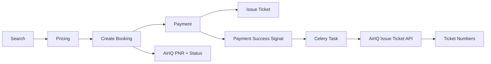

# 🚀 Complete Flight Booking with AirIQ Integration Guide

## ✅ What We Fixed

### 1. **Commission Auto-Calculation**
- **❌ Before**: Required `commission_info` in request payload
- **✅ After**: Automatically calculated server-side using existing hotel logic
- **Implementation**: Added commission calculation in `BookingSerializer.create()` after pricing

### 2. **Proper AirIQ Integration** 
- **✅ Block PNR Support**: `block_pnr: true/false` for held vs confirmed bookings
- **✅ Automatic Ticket Issuance**: After payment success via Celery task
- **✅ Payment Integration**: Uses existing hotel payment system
- **✅ Error Handling**: Retry logic with exponential backoff

### 3. **Seamless Payment Flow**
- **✅ Reuses Hotel Payment System**: Same endpoints, same logic
- **✅ Multiple Payment Methods**: Wallet, PhonePe, PayU
- **✅ Automatic Processing**: Payment → Ticket issuance → Confirmation email

---

## 🔄 Complete Flight Booking Flow

### **Step 1: Authentication**
```http
POST {{baseUrl}}/auth/token/
{
  "email": "user@example.com",
  "password": "password"
}
```

### **Step 2: Search Flights**
```http
POST {{baseUrl}}/flights/search/search/
{
  "origin": "DEL",
  "destination": "BOM",
  "departure_date": "2025-11-20",
  "trip_type": "O",
  "adults": 1,
  "search_mode": "BOTH"
}
```
**→ Response**: Returns `flight_option_id` and `track_id`

### **Step 3: Get Pricing (Optional)**
```http
POST {{baseUrl}}/flights/pricing/price/
{
  "flight_option_id": 123,
  "passenger_count": {
    "adults": 1,
    "children": 0,
    "infants": 0
  }
}
```
**→ Response**: Returns `pricing_token`

### **Step 4: Create Flight Booking** ⭐
```http
POST {{baseUrl}}/booking/bookings/
Authorization: Bearer {{token}}
{
  "booking_type": "FLIGHT",
  "adult_count": 1,
  "child_count": 0,
  "infant_count": 0,
  "flight_trip": "ONE-WAY",
  "flight_class": "ECONOMY",
  "trip_type": "O",
  "total_amount": 5000,
  "base_origin": "DEL",
  "base_destination": "BOM",
  "block_pnr": false,
  "track_id": "{{track_id}}",
  "pricing_token": "{{pricing_token}}",
  "flight_segments": [
    {
      "FlightID": "7786",
      "FlightNumber": "I5 821",
      "Origin": "DEL",
      "Destination": "BOM",
      "DepartureDateTime": "20 Nov 2025 10:00",
      "ArrivalDateTime": "20 Nov 2025 12:10"
    }
  ],
  "passengers": [
    {
      "passenger_ref": 1,
      "passenger_type": "ADT",
      "title": "MR",
      "first_name": "JOHN",
      "last_name": "DOE",
      "date_of_birth": "1990-01-01",
      "gender": "male"
    }
  ],
  "contact": {
    "country_code": "91",
    "phone": "7338085595",
    "email": "vighnesha@idbookhotels.com"
  },
  "gst_info": {},
  "seats": [],
  "baggage": [],
  "meals": [],
  "other_services": [],
  "frequent_flyer": []
}
```
**→ Response**: Returns `booking_id` and booking status

### **Step 5: Get Payment Methods**
```http
GET {{baseUrl}}/booking/payment/booking-payment-methods/?booking_id={{booking_id}}
Authorization: Bearer {{token}}
```

### **Step 6: Initiate Payment**
```http
POST {{baseUrl}}/booking/payment/initiate-payment/
Authorization: Bearer {{token}}
{
  "booking_id": {{booking_id}},
  "amount": 5000,
  "payment_channel": "WALLET",  // or "PHONE PAY" or "PAYU"
  "redirect_url": "https://yourapp.com/payment-success"
}
```

### **Step 7: Automatic Post-Payment Processing** 🤖
**After successful payment, the system automatically:**
1. **Triggers Signal**: `handle_flight_payment_success`
2. **Queues Task**: `issue_flight_ticket_task.delay(booking_id)`
3. **Calls AirIQ**: `airiq_service.issue_ticket()`
4. **Updates Status**: Flight booking → `TICKETED`
5. **Sends Email**: Confirmation with ticket attachment
6. **Creates Invoice**: PDF invoice generation

---

## 🔧 AirIQ Specific Considerations

### **Block PNR Options**
- **`block_pnr: false`** → **Immediate Booking**
  - Creates CONFIRMED booking in AirIQ
  - Requires immediate payment
  - Ticket issued after payment

- **`block_pnr: true`** → **Hold Booking**
  - Creates HELD booking in AirIQ  
  - Hold expires in ~30 minutes
  - Must complete payment before expiry
  - Then ticket issued

### **AirIQ API Call Sequence**


### **Error Handling & Retries**
- **Payment Failures**: Payment gateway handles retries
- **Ticket Issuance Failures**: 3 retries with exponential backoff
- **AirIQ API Failures**: Logged with full request/response
- **Hold Expiry**: Booking marked as expired

---

## 📋 Key Implementation Changes

### **1. BookingSerializer Changes**
```python
# Made commission_info optional and read-only
commission_info = BookingCommissionSerializer(required=False, read_only=True)

# Added automatic commission calculation
if booking_type == 'FLIGHT' and company_detail.subtotal:
    commission_details = commission_calculation(
        property_id=None,  # Flight bookings don't have property_id
        subtotal=company_detail.subtotal or 0,
        total_discount=0,
        final_amount=company_detail.final_amount or 0,
        final_tax_amount=company_detail.gst_amount or 0,
        pay_at_hotel=False
    )
    if commission_details:
        add_or_update_booking_commission(company_detail.id, commission_details)
```

### **2. Payment Success Signal**
```python
@receiver(post_save, sender=BookingPaymentDetail)
def handle_flight_payment_success(sender, instance, **kwargs):
    if (instance.is_transaction_success and 
        instance.booking.booking_type == 'FLIGHT' and 
        instance.booking.flight_booking):
        
        # Queue ticket issuance
        issue_flight_ticket_task.delay(instance.booking.id)
```

### **3. Ticket Issuance Task**
```python
@celery_idbook.task(bind=True, max_retries=3)
def issue_flight_ticket_task(self, booking_id):
    # Call AirIQ issue_ticket API
    # Update flight booking with ticket numbers
    # Send confirmation email
    # Handle retries on failure
```

---

## 🗂️ Updated Files

### **Core Changes**
1. **`apps/booking/serializers.py`**
   - Made `commission_info` optional and read-only
   - Added automatic commission calculation

2. **`apps/booking/signals.py`**
   - Added payment success signal handler
   - Triggers automatic ticket issuance

3. **`apps/booking/tasks.py`**
   - Added `issue_flight_ticket_task`
   - Handles AirIQ ticket issuance with retries

### **Postman Collections** 
4. **`IDBOOK-Flights-Fixed.postman_collection.json`**
   - Removed `commission_info` from request payload
   - Added payment method endpoints
   - Updated with realistic flight data

5. **`fixed_flight_booking_final.json`**
   - Clean payload without commission_info
   - Ready-to-use booking request

---

## ✅ Testing Checklist

### **Basic Flow**
- [ ] Login and get JWT token
- [ ] Search flights (get track_id)
- [ ] Create flight booking (no commission_info needed)
- [ ] Get payment methods
- [ ] Initiate wallet payment
- [ ] Verify booking confirmed
- [ ] Check ticket issuance (automatic)
- [ ] Confirm email sent

### **AirIQ Integration**
- [ ] Block PNR = false (immediate booking)
- [ ] Block PNR = true (held booking)
- [ ] Payment within hold time limit
- [ ] Ticket issuance after payment
- [ ] Error handling and retries

### **Payment Methods**
- [ ] Wallet payment (immediate)
- [ ] PhonePe payment (redirect)
- [ ] PayU payment (redirect)
- [ ] Payment failure handling

---

## 🎯 Next Steps

1. **Test the complete flow** using the fixed Postman collection
2. **Monitor ticket issuance** - check Celery logs for task execution
3. **Verify AirIQ calls** - check AirIQApiLog model for API interactions
4. **Configure email templates** for flight ticket confirmations
5. **Set up monitoring** for payment failures and retry alerts

The system is now fully integrated and follows the same proven patterns as hotel bookings, ensuring reliability and consistency across all booking types! 🚀